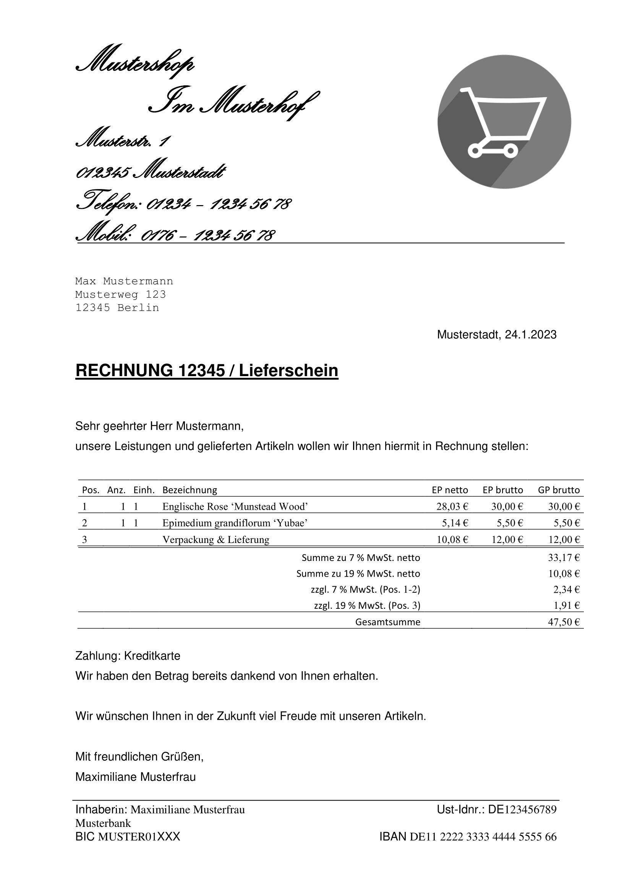
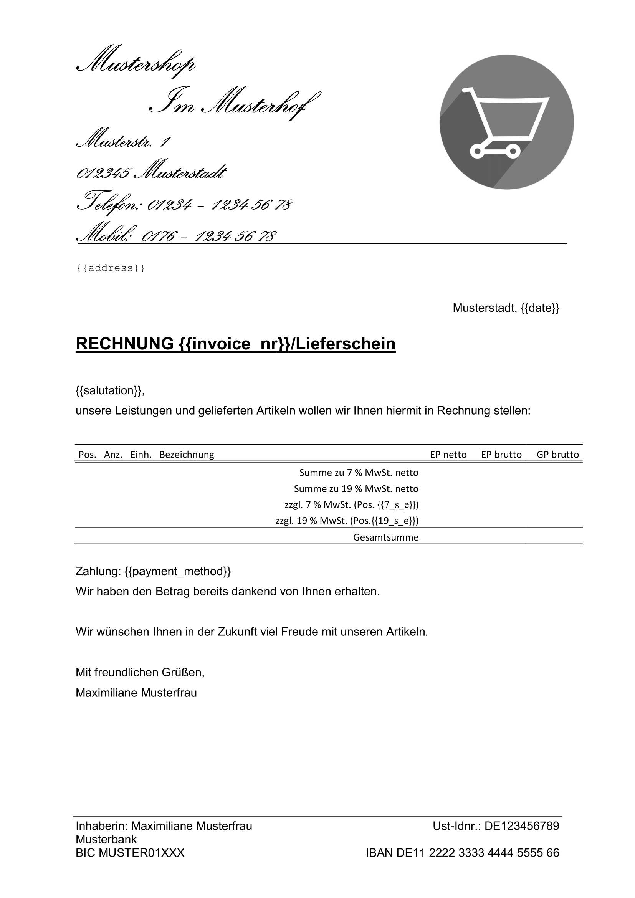

# invoicer
A Gmail bot that generates invoices from order confirmation emails and sends it to seller in real-time.

For example, given the incoming order confirmation email (in German):

```
Hallo!

Du hast eine Bestellung (123) über deinen Online-Shop www.muster-shop.de erhalten:


==========

1 x "Englische Rose 'Munstead Wood'" : 30,00 €
1 x "Epimedium grandiflorum 'Yubae'" : 5,50 €
Summe für alle Artikel: 35,50 €

==========


Versandkosten (inkl. MwSt.): 12,00 €
----------------------------------------
----------------------------------------
Gesamtpreis (inkl. MwSt.): 47,50 €


Bezahlmethode: Kreditkarte

*Rechnungs- und Versandadresse*
Max Mustermann
Musterweg 123
12345 Berlin
Deutschland
+491761234567
maxmustermann@email.de
```

The bot parses and converts it to the following print-ready invoice seconds after arrival to its inbox:



After generating the invoice above, the bot sends it to the seller with email as attachment.

## New: Replying Customer Emails
Occassionally, customers send emails to the Invoicer email address and they may left unanswered as the account is a service account. To fix this problem, the bot now forwards these emails to seller and informs the customer about the forwarding. 

## Running a Demo
You can run a demo by either of the following:
1. Running a Docker image (recommended);
2. Cloning the application to your system. 

For both options, you should first do the prerequisites:
### Prerequisites
1. Open the invoice template at `docs/template_sample.docx` with Word 2016+:



    Customize the template according to your wishes. You can add extra text, images etc.

    Note that you should treat the text within '{{}}' as special and not replace the characters inside of it. You can, however, move them freely throughout the document. Do not change the column number in the table as well.   
    Create a `config.json` similar to the following sample and edit it according to your specs. You can refer to the explanation section for clarifications.
    ```json
    {
        "orderMail": {
            "sender": "no-reply@hoster.de",
            "subjectHas": "Neue Bestellung"
        },
        "invoiceMail": {
            "to": "info@mustershop.de",
            "saluteName": "Maximiliane"
        },
        "invoiceCountStart": 0,
        "pollInterval": 10
    }
    ```
    **Explanation for the fields**:
    - **orderMail.sender**: Email account sending order confirmations
    - **orderMail.subjectHas**: A substring in subject line for order confirmation emails
    - **invoiceMail.to**: Email address to send the generated invoice
    - **invoiceMail.saluteName**: Salutation name for the email address holder
    - **invoiceCountStart**: Last invoice number before the start of Gmail bot
    - **pollInterval**: Period of polls in seconds for checking any incoming order confirmation emails 

5. For Google OAuth Servers to identify the app, create a OAuth2 Client ID for the app following the instructions on below link:

     https://developers.google.com/gmail/api/quickstart/python#authorize_credentials_for_a_desktop_application 

    Afterwards, save `credentials.json` to a directory and take steps to protect and secure the file. We will pass it later to our application.


After fulfilling above prerequisites, choose either one of the following:
### Option 1: Using Docker Image (Recommended)
Firstly, Install Docker through https://docs.docker.com/engine/install/ if you haven't done yet.

Follow these steps to start the application in a Docker container:

```
docker pull ghcr.io/mehmetalici/invoicer:latest
docker run -it -v /path/to/your/config.json:/etc/invoicer/config.json -v /path/to/your/credentials.json:/etc/invoicer/credentials.json -v /path/to/your/template.docx:/etc/invoicer/template.docx --network=host invoicer 
```

### Option 2: Manual Installation
#### Prerequisites
1. Poetry package manager
    
    Install it from https://python-poetry.org/docs/.

2. Python ^3.10.6

    You can use Pyenv https://github.com/pyenv/pyenv.

#### Installation
1. Clone repository and install dependencies:
    ```
    git clone git@github.com:mehmetalici/invoicer.git
    cd invoicer
    poetry install
    ```

2. Start the application with the following command:
    ```
    poetry run python app.py -c /path/to/your/config.json -d /path/to/your/credentials.json -p /path/to/your/template.docx
    ```

### Operation
1. If you run for the first time, a web page will prompt you to authenticate your Gmail account and authorize the bot to manage the account.
2. After the authentication flow has completed, the app will start to its normal operation and output the following information:
    ```
    2023-06-24 15:33:32 INFO     Searching for orders...
    2023-06-24 15:33:32 INFO     No new orders are found.
    2023-06-24 15:33:32 INFO     Searching for customer emails...
    2023-06-24 15:33:32 INFO     No new customer emails are found.
    2023-06-24 15:33:32 INFO     Waiting for 10s
    ```
3. If a new order confirmation mail appears, it will output the following:
    ```
    2023-02-05 13:48:39 INFO     Searching for orders...
    2023-02-05 13:48:40 INFO     1 new orders are found, creating invoices...
    2023-02-05 13:48:43 INFO     Invoice is created at docs/Invoice-2023001.docx
    2023-02-05 13:48:45 INFO     Mail has been sent. Message Id: 186219f2db25b235
    2023-02-05 13:48:45 INFO     Sleeping for 10s
    ```